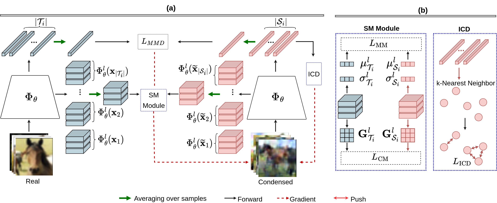

# Decomposed Distribution Matching in Dataset Condensation

Official PyTorch implementation of **"Decomposed Distribution Matching in Dataset
Condensation"**, published at **WACV 2025**.

**Paper:** [Sahar Rahimi Malakshan, Mohammad Saeed Ebrahimi Saadabadi, Ali Dabouei, Nasser Nasrabadi.
*Decomposed Distribution Matching in Dataset Condensation.* WACV 2025, pp. 7112-7122](https://openaccess.thecvf.com/content/WACV2025/html/Malakshan_Decomposed_Distribution_Matching_in_Dataset_Condensation_WACV_2025_paper.html)

## Abstract

Dataset Condensation (DC) aims to reduce deep neural networks training efforts by
synthesizing a small dataset such that it will be as effective as the original large
dataset. Conventionally, DC relies on a costly bi-level optimization which prohibits its
practicality. Recent research formulates DC as a distribution matching problem which
circumvents the costly bi-level optimization. However, this efficiency sacrifices the DC
performance.
To investigate this performance degradation, we decomposed the dataset distribution into
content and style. Our observations indicate two major shortcomings of: 1) style discrepancy
between original and condensed data, and 2) limited intra-class diversity of condensed
dataset.
We present a simple yet effective method to match the style information between original and
condensed data, employing statistical moments of feature maps as well-established style
indicators.
Moreover, we enhance the intra-class diversity by maximizing the Kullback–Leibler divergence
within each synthetic class, i.e., content.
We demonstrate the efficacy of our method through experiments on diverse datasets of varying
size and resolution, achieving improvements of up to 8.3% on CIFAR10, 7.9% on CIFAR100, 3.6%
on TinyImageNet, 5% on ImageNet-1K, 5.9% on ImageWoof, 8.3% on ImageNette, and 5.5% in
continual learning accuracy.

## Pipeline



The proposed method comprises a **Style Matching (SM)** module and an **Intra-Class
Diversity (ICD)** component. (b) The SM module includes Moments Matching (MM) and Correlation
Matching (CM) losses, which reduce the style discrepancy between the real and the condensed
set using the mean and variance of feature maps as well as the correlation among feature maps
captured by the Gram matrix across layers of a DNN. The ICD component enhances diversity
within each condensed class.

---

## Install

```bash
pip install -r requirements.txt
```

Tested with Python 3.11 and PyTorch 2.x on CUDA. Datasets download themselves on first use;
TinyImageNet and ImageNet need one preparation step, described in
[docs/datasets.md](docs/datasets.md).

## Usage

Everything is one command with one config file.

```bash
# the released method
python train.py --config configs/ours/cifar10_ipc10.yaml

# the distribution-matching baseline
python train.py --config configs/dm/cifar10_ipc10.yaml

# a coreset baseline
python train.py --config configs/coreset/cifar10_ipc10_herding.yaml

# evaluate a set you already built, on architectures it was not condensed on
python evaluate.py --config configs/eval/cross_arch.yaml \
    --checkpoint runs/ours_cifar10_ipc10/condensed_CIFAR10_ConvNet_style_10ipc.pt
```

Anything in a config can be overridden for a quick experiment:

```bash
python train.py --config configs/ours/cifar10_ipc10.yaml \
    --set data.ipc=50 condense.iterations=5000 output.save_path=runs/quick
```

A run writes its resolved config, log, image grid, checkpoint and a `results.json` row into
`output.save_path`. `python scripts/collect_results.py runs` renders every row it finds as a
markdown table.

## Configs

```
configs/
    base.yaml               defaults shared by every method
    dm/                     plain distribution matching -- the baseline
    ours/                   the released method
    ablation/               one term at a time: mm_only, cm_only, sm_only, icd_only, ...
    coreset/                the eight coreset selectors
    eval/                   evaluation-only protocols, including cross-architecture
```

Configs compose with `inherit:`, so a method config only states what it changes. Every key
is documented in [docs/configs.md](docs/configs.md).

Available budgets and datasets: `data.ipc` ∈ {1, 10, 50, ...}; `data.dataset` ∈ {MNIST,
FashionMNIST, SVHN, CIFAR10, CIFAR100, TinyImageNet, ImageNet}; `model.arch` ∈
{ConvNet, ConvNet_style, AlexNet, VGG11, ResNet18, ...} and their `_style` variants.

## Coreset baselines

Eight classical selection methods share the budget and the evaluation protocol with the
condensation methods, so their rows are directly comparable:

`random`, `herding`, `kcenter`, `kmeans`, `forgetting`, `uncertainty`, `el2n`, `grand`.

Each is documented -- what it optimises, its hyperparameters, its reference paper, and where
it breaks down at condensation-sized budgets -- in [docs/coreset.md](docs/coreset.md), which
also carries a measured CIFAR10 table for all eight.

## Repository layout

```
train.py                 build a condensed set or select a coreset, from a config
evaluate.py              score a set that already exists
ddm/
    config.py            YAML loading, inheritance, --set overrides, validation
    data.py              datasets
    models.py            architecture factory
    networks.py          the architectures
    augment.py           DSA
    losses/
        style.py         L_MM, L_CM        -- Style Matching module
        diversity.py     L_ICD             -- Intra-Class Diversity module
    engine/
        condense.py      the distribution-matching loop
        select.py        the coreset selection loop
        evaluator.py     the shared evaluation protocol
    coreset/             one module per selector, plus the shared proxy network
configs/                 every run is one of these
docs/                    method, coreset methods, config schema, datasets, results
scripts/                 dataset preparation, results collection, smoke test
```

## Documentation

| | |
| --- | --- |
| [docs/method.md](docs/method.md) | the method, term by term |
| [docs/coreset.md](docs/coreset.md) | the eight coreset baselines |
| [docs/configs.md](docs/configs.md) | every config key |
| [docs/datasets.md](docs/datasets.md) | dataset setup |
| [docs/results.md](docs/results.md) | measured numbers and the protocol behind them |
| [docs/extending.md](docs/extending.md) | adding a loss, a selector, a dataset, an architecture |

## Distilled datasets

Distilled datasets (saved as tensors) for various numbers of images per class are available
[here](https://drive.google.com/drive/folders/1zq8YNzUoTd2N0kuGTZLwDjFuSCOo8Fih?usp=drive_link).

## Branches

`main` is the organised release described above. `dev` keeps the previous flat layout
(`DM_DDM.py`, `DM_KNearest.py`, `utils_DM.py`, ...) for reference; the mapping from those
scripts to configs is in [docs/configs.md](docs/configs.md) and in the `configs/ablation/`
headers.

## Citation

```bibtex
@InProceedings{Malakshan_2025_WACV,
    author    = {Malakshan, Sahar Rahimi and Saadabadi, Mohammad Saeed Ebrahimi and
                 Dabouei, Ali and Nasrabadi, Nasser},
    title     = {Decomposed Distribution Matching in Dataset Condensation},
    booktitle = {Proceedings of the Winter Conference on Applications of Computer Vision (WACV)},
    month     = {February},
    year      = {2025},
    pages     = {7112-7122}
}
```
