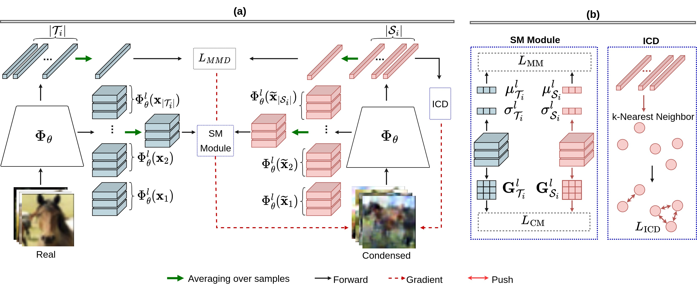

Official PyTorch implementation of **"Decomposed Distribution Matching in Dataset Condensation"**, published as a conference paper at WACV 2025.

# Abstract

Dataset Condensation (DC) aims to reduce deep neural networks training efforts by synthesizing a small dataset such that it will be as effective as the original large dataset. Conventionally, DC relies on a costly bi-level optimization which prohibits its practicality. Recent research formulates DC as a distribution matching problem which circumvents the costly bi-level optimization. However, this efficiency sacrifices the DC performance.
   To investigate this performance degradation, we decomposed the dataset distribution into content and style. Our observations indicate two major shortcomings of: 1) style discrepancy between original and condensed data, and 2) limited intra-class diversity of condensed dataset.
   We present a simple yet effective method to match the style information between original and condensed data, employing statistical moments of feature maps as well-established style indicators.
   Moreover, we enhance the intra-class diversity by maximizing the Kullback–Leibler divergence within each synthetic class, \ie, content.
   We demonstrate the efficacy of our method through experiments on diverse datasets of varying size and resolution, achieving improvements of up to 8.3\% on CIFAR10, 7.9\% on CIFAR100, 3.6\% on TinyImageNet, 5\% on ImageNet-1K, 5.9\% on ImageWoof, 8.3\% on ImageNette, and 5.5\% in continual learning accuracy.

# Pipeline

Visualization of the proposed method, which includes a Style Matching (SM) module and Intra-Class Diversity (ICD) components. (b) SM module includes Moments Matching (MM) and Correlation Matching (CM) losses to reduce style discrepancies between real and condensed sets by using the \ie, mean and variance of feature maps as well as correlation among feature maps captured by the Gram matrix in a DNN across different layers. Meanwhile, the ICD component enhances diversity within condensed sets by pushing each condensed sample away from its $k$ nearest intra-class neighbors.

## Setup
Install packages in the requirements file.


## Usage

To run distribution matching with Style Matching (using Gram or Correlation Matching loss), use the following command:
```
python DM_GramMatching.py  --dataset CIFAR10  --model ConvNet_style  --ipc 10  --dsa_strategy color_crop_cutout_flip_scale_rotate  --init real   --Iteration 20000 --num_exp 5  --num_eval 5  --save_path result_cifar10_DM_StyleMatching   --style_ratio 10000
# --dataset: CIFAR10, CIFAR100, TinyImageNet
# --ipc (images/class): 1, 10, 20, 30, 40, 50
#--model: ConvNet_style, ResNet18_style, AlexNet_style, VGG11_style
```

To run distribution matching with Style Matching (using Moments Matching loss), use the following command:
```
python DM_MeanStd_Matching.py  --dataset CIFAR10  --model ConvNet_style  --ipc 10  --dsa_strategy color_crop_cutout_flip_scale_rotate  --init real   --Iteration 10000 --num_exp 5  --num_eval 5  --save_path result_cifar10_DM_StyleMatching   --style_ratio 10000
```

To run distribution matching while promoting intra-class diversity (using Intra-Class Diversity loss), use the following command:
```
python DM_KNearest.py  --dataset CIFAR10  --model ConvNet  --ipc 10  --dsa_strategy color_crop_cutout_flip_scale_rotate  --init real   --Iteration 20000 --num_exp 5  --num_eval 5  --save_path result_cifar10_DM_KNearest --icd_ratio 10
```

The repository is based on [this repo](https://github.com/VICO-UoE/DatasetCondensation), please cite their paper [Dataset Condensation with Distribution Matching](https://arxiv.org/pdf/2110.04181) if you use the code. 


